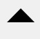
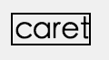
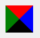
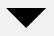

### 写在前面的话
我从来没有在自己博客上贴过图，因为我觉得麻烦，我喜欢用markdown写东西，如果要贴图的话感觉会不那么好管理。不过既然我决定做前端方面的工作，看来这图是一定要贴了。今天来点轻松点的话题。如何通过css代码实现我们熟悉的**箭头图标**。



稍后会解析它的原理。

### 如何实现

箭头这种东西，我一直以为是贴图来的，后来看了一些css相关的东西，才知道css这东西，不只是能够用来调整位置和颜色。还可以用来画一些比较简单的图形(好吧，复杂的也可以)。就如上面这个箭头，其实只是很简单的几行代码就能实现。虽说只是几行代码的事情，But，如果去理解它的原理，也会是相当有趣的。


##### 骨架
首先肯定要准备好骨架, 也就是我们的html

``` html
<div class="caret"></div>
```

对，没错，骨架就是那么简单。很多有趣的图形，只需要一个`div`就能做出来了。(我现在也只会这个，就先说这个吧!!!)


##### 样式

重点来看看样式。

###### 1. 大家都熟悉的样子
先来举个简单的例子:

``` html
<div class="caret">caret</div>
```

``` css
.caret {
	display: inline-block;
    border-bottom: 1px solid;
    border-left: 1px solid;
    border-top: 1px solid;
    border-right: 1px solid;
}
```

正常情况下会现实成这样:




这种情况相信大家都很熟悉吧。这里就不多说了。


###### 2. 做点小调整,把边框放大
现在我们开始做一些很奇怪的事情。我们吧每个边的线条的宽度都设置成`10px`会怎样呢?
代码如下(默认黑色了):

``` css
.caret {
	display: inline-block;
    border-bottom: 10px solid;
    border-left: 10px solid;
    border-top: 10px solid;
    border-right: 10px solid;
}
```

现在的效果就是这样的:


what，似乎有点儿三角形的样子。(其实还没有)

###### 3. 修改边框的颜色, 区分不同的边框

现在我做点更无耻的事情。我把每条边的颜色都调成不一样的。

``` css
.caret {
	display: inline-block;
    border-bottom: 10px solid black;
    border-left: 10px solid green;
    border-top: 10px solid red;
    border-right: 10px solid blue;
}
```

我擦，现在是这样的。


越来越有三角形的感觉了，原来邻边的交界处是一人占据一半。我们看这个图，如果我们把文字`caret`所在的框无限缩小到一个点会出现什么呢？是不是会出现了4个颜色不一样的三角形呢？我们试试看。我们把骨架的文字去掉，保险起见。把所在的盒子模型的长宽都设置成0:

``` html
<div class="caret"></div>
```

``` css
.caret {
	display: inline-block;
	width: 0px;
	height: 0px;
    border-bottom: 10px solid black;
    border-left: 10px solid green;
    border-top: 10px solid red;
    border-right: 10px solid blue;
}
```

这....果然不出我们所料。四个三角形出现了。



这里得提一下，4个等腰直角三角形的直角顶点到最长那条边的距离就是10px。(不信可以用截图工具去量一下)。这已经完成了百分之80了。我们只需要取其中的一个修改成我们想要的颜色跟大小就可以了。我们要一个向下的箭头，这里为了避免偏移我们不设置`border-bottom`的值，我们把 `border-left`, `border-right`的值分别设置为透明，在稍微调整一下边框大小，还有，最后`border-top`的颜色我们设置回黑色。

``` css
.caret {
	display: inline-block;
	width: 0px;
	height: 0px;
    border-left: 10px solid transparent;
    border-top: 10px solid;
    border-right: 10px solid transparent;
}
 
```

这就能得到我们想要的图案了。



虽然只要几行代码，不过我觉得它的原理是比较有趣的。所以，今天就到这吧。感谢你能看完。


# Happy Coding!! ^_^
